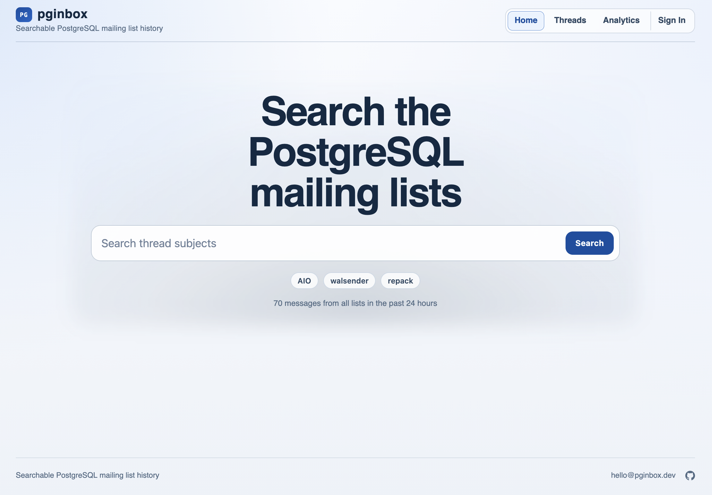
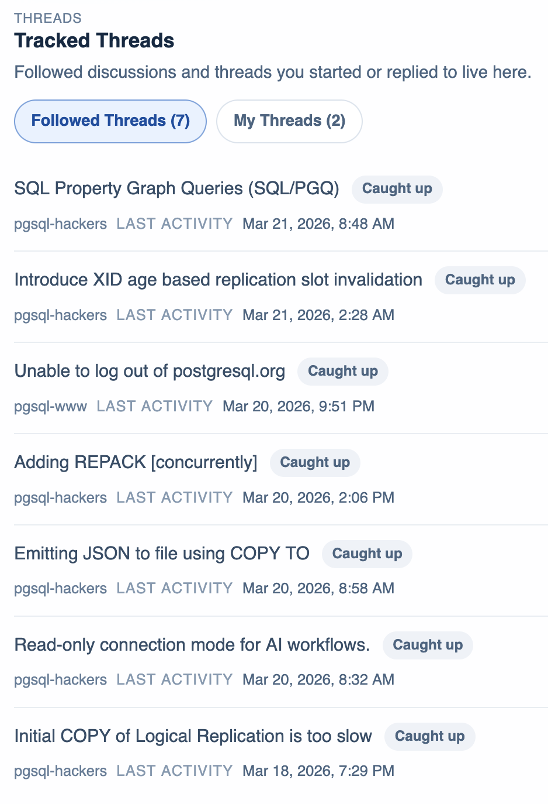
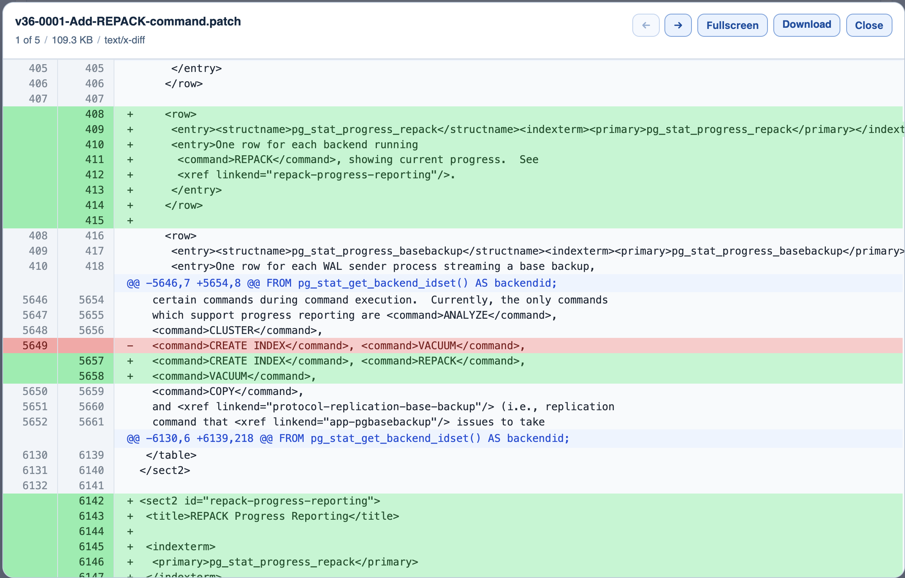
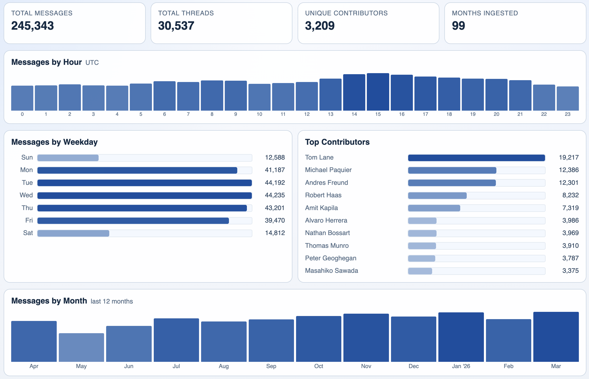

# pginbox

pginbox is a searchable, browsable archive for PostgreSQL mailing lists. It is meant to complement,
not replace, the existing mailing lists and archive.

It turns years of mailing-list discussion into something you can actually navigate — threads, messages, contributors, and activity patterns, all in one place.

The browsing experience is open to the public with no account. Some features do require an account,
but pginbox is now and always will be a free service.

<table>
  <tr>
    <td></td>
    <td></td>
  </tr>
  <tr>
    <td></td>
    <td></td>
  </tr>
</table>

## Why it exists

PostgreSQL's mailing lists hold an enormous amount of project history: design decisions, bug investigations, feature debates, contributor context. That history is genuinely valuable, but hard to explore in raw archive form. pginbox makes it easier to find and understand.

## What you can do

- Browse lists and discussion threads
- Open full thread views with message timelines
- Follow certain threads and receive unobtrustive notifications when they have new messages
- Signed in users will automatically follow threads in which they participate
- Read attachments with diff highlighting and navigation in a clean overlay
- View activity summaries over time

## Who it's for

- PostgreSQL contributors and maintainers looking to understand past context
- Engineers researching how a feature or bug was discussed
- Researchers studying open-source collaboration patterns
- Anyone who finds mailing list archives useful but hard to navigate

## Status

pginbox is actively evolving. The core archive and API are in place, and the frontend experience is being built out. The long-term goal: make PostgreSQL mailing-list history easy to search, understand, and learn from.
